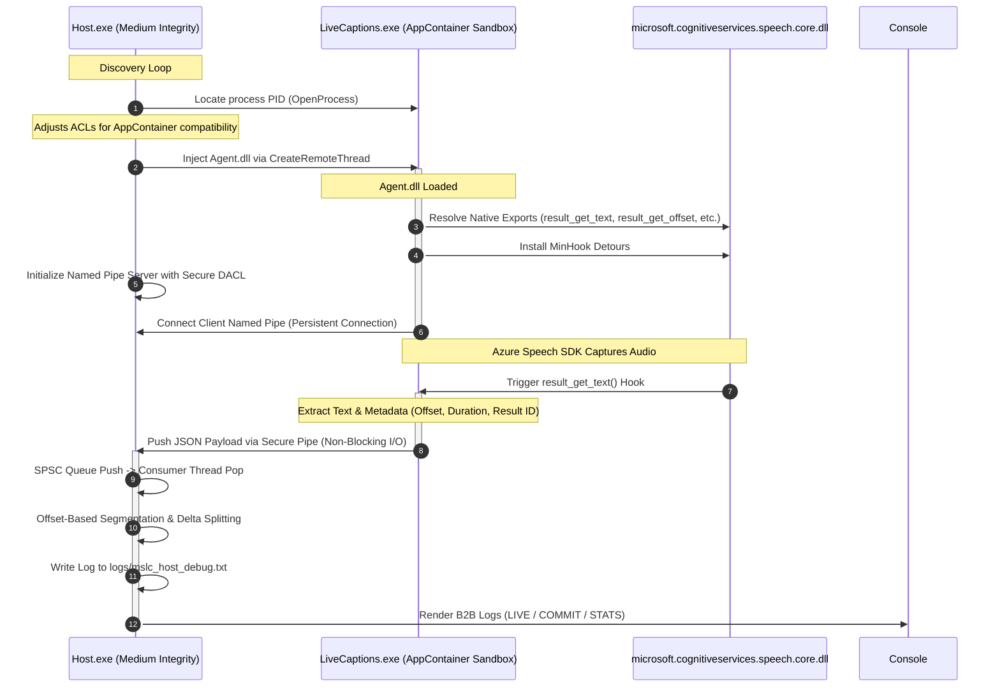

# Microsoft Live Captions Extractor (MSLC Extractor)

MSLC Extractor is a native Windows utility designed to intercept real-time subtitle text streams from the Microsoft Live Captions engine (`LiveCaptions.exe`). By hooking into the low-level APIs of the Microsoft Azure Speech SDK core module, it extracts, processes, and logs real-time spoken text with zero UI layout dependencies and minimal resource footprint.

The system is split into two primary components:
1.  **Host** ([Host.cpp](file:///C:/Users/hungl/Documents/mslc-extractor/Host/Host.cpp)): A standalone C++ controller executable (`Host.exe`) that manages injector operations, runs a secure Named Pipe IPC server, processes raw text using an advanced sentence-splitting algorithm, logs output in a robust format, and monitors target process life cycles.
2.  **Agent** ([dllmain.cpp](file:///C:/Users/hungl/Documents/mslc-extractor/Agent/dllmain.cpp)): A dynamic-link library (`Agent.dll`) injected into the target process sandbox. It hooks the Azure Speech SDK's native exports to intercept recognized caption strings and associated metadata (such as timestamps, durations, and result IDs) directly from memory.

---

## How It Works



### JSON IPC Payload Format
Packets are transmitted via the named pipe as compact JSON strings:
```json
{
  "text": "this is a real time caption",
  "is_final": false,
  "offset": 123400000,
  "duration": 25000000,
  "result_id": "abc123e4f5g6789h",
  "ts_ms": 1717900000000
}
```
*   `offset` / `duration`: Stored in 100-nanosecond ticks (SDK native units). The Host converts these to seconds for display.
*   `is_final`: Indicates whether the SDK has completed processing the current audio segment.

---

## Command-Line Interface (CLI Flags)

The `Host.exe` executable supports a rich suite of command-line flags to streamline automated deployments, scripting integrations, and testing:

| Flag / Option | Description |
| :--- | :--- |
| `-p, --pid <PID>` | Target a specific process ID directly, skipping the automatic process discovery loop. |
| `-n, --pipe-name <name>` | Use a custom Named Pipe name (default: `LiveCaptionPipe`). Allows running multiple instances concurrently. |
| `-d, --debug` | Enable verbose debug logging to stdout instead of capping local debug files. |
| `--log-path <path>` | Specify a custom folder or file path for the Host's runtime debug logs. |
| `--stdout` | Streams clean JSON subtitles directly to Standard Output, facilitating Unix-pipe integration with Python, NodeJS, or Tauri wrappers. |
| `--no-spawn` | Prevents the Host from invoking Windows ShellExecute to open the Live Captions Settings panel if the process is not found. |
| `--inject-only` | Injects `Agent.dll` into the target process and immediately terminates the Host, leaving pipe management to external tools. |
| `-m, --mock` | **MVW Mock Mode**: Simulates real-time Azure Speech SDK caption packets. Runs the entire pipeline, sentence splitter, and console UI offline without target process dependency. |

---

## Build Instructions

### Prerequisites
*   **Operating System**: Windows 11 (with the Live Captions feature installed and enabled).
*   **IDE**: Visual Studio 2022 (with "Desktop development with C++" workload).
*   **Dependencies**: MinHook library (headers and libraries are embedded in the repository).

### Steps
1.  Open the Visual Studio Solution: [Native.sln](file:///C:/Users/hungl/Documents/mslc-extractor/Native.sln).
2.  Set the Active Build Configuration:
    *   **Platform**: `x64` (Microsoft Live Captions runs as a 64-bit application; x86 build is not supported).
    *   **Configuration**: `Release`.
3.  Perform a Build:
    *   Right-click the Solution and select **Build Solution**.
    *   Alternatively, run MSBuild via the Developer Command Prompt:
        ```powershell
        msbuild Native.sln /p:Configuration=Release /p:Platform=x64
        ```
4.  Binaries will be output to the directory: `x64\Release\`.

---

## Usage

### Prerequisites
*   Run the host application inside a terminal with standard privileges.
*   If `LiveCaptions.exe` is not running, and `--no-spawn` is not set, the Host will automatically open the Windows Live Captions activation screen.

### Running in Standard Mode
To launch the extractor with standard console output:
```powershell
cd x64\Release
.\Host.exe
```

**Example Output**:
```text
[2026-06-10 18:15:30.124] [Host] Discovery: Scanning for LiveCaptions.exe...
[2026-06-10 18:15:31.450] [Host] Discovery: Found LiveCaptions.exe (PID: 8432)
[2026-06-10 18:15:31.465] [Host] Injector: Setting AppContainer permissions on Agent.dll
[2026-06-10 18:15:31.490] [Host] Injector: DLL successfully injected into PID 8432
[2026-06-10 18:15:31.512] [Host] Named Pipe server listening on: \\.\pipe\LiveCaptionPipe
[2026-06-10 18:15:32.100] [Host] Named Pipe connection established. Starting consumer loop...

[LIVE]   welcome to the live demo of the extraction engine (updates in-place)
[COMMIT] [Offset: 1.45s, Duration: 3.20s] [ID: s8g9d8f9...] Welcome to the live demo of the extraction engine.
[STATS]  Packets: 24 | Bytes: 412 B | Delay: 12 ms | Queue Size: 0
[LIVE]   we are checking the performance of the offset segmentation algorithm (updates in-place)
```

### Running in Mock Mode (Offline Testing)
To verify the UI, sentence splitter, and pipeline without hooking the system:
```powershell
.\Host.exe -m
```

### Streaming JSON to stdout (Integration Mode)
To stream subtitle packets into a NodeJS or Python process:
```powershell
.\Host.exe --stdout --no-spawn | node your_subtitle_processor.js
```

---

## Security & Privacy Notice

> [WARNING]
> Because `Host.exe` uses low-level system calls (`VirtualAllocEx`, `WriteProcessMemory`, and `CreateRemoteThread`) to inject a DLL into another running process, **Windows Defender and other antivirus tools will flag this utility as a Trojan (e.g. Wacatac.C!ml, Sabsik, or Bearfoos)**. These are heuristic machine learning alerts (`!ml`) triggered by DLL injection behaviors.
>
> To use this utility, you must whitelist the folder containing the binaries or build the executable from source to verify its safety.

### Verifying Hashes
To ensure the integrity of your built binaries, you can generate SHA-256 hashes and compare them with the release metadata:
```powershell
CertUtil -hashfile .\x64\Release\Host.exe SHA256
CertUtil -hashfile .\x64\Release\Agent.dll SHA256
```

---

## License

This project is licensed under the MIT License - see the [LICENSE](LICENSE) file for details.

---

## Disclaimer

This tool is designed to enhance accessibility by extracting Live Captions output. Users are responsible for complying with local laws regarding audio recording, transcription, and privacy.